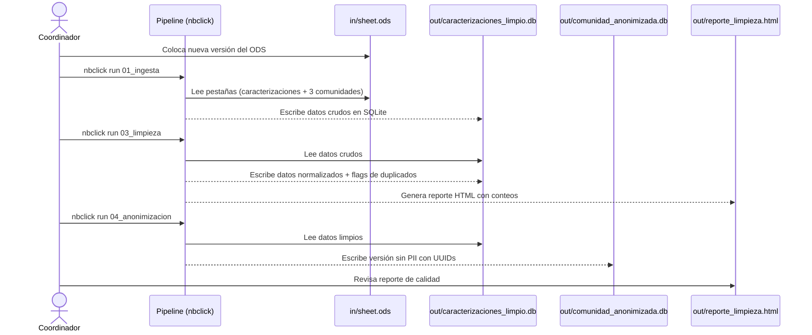
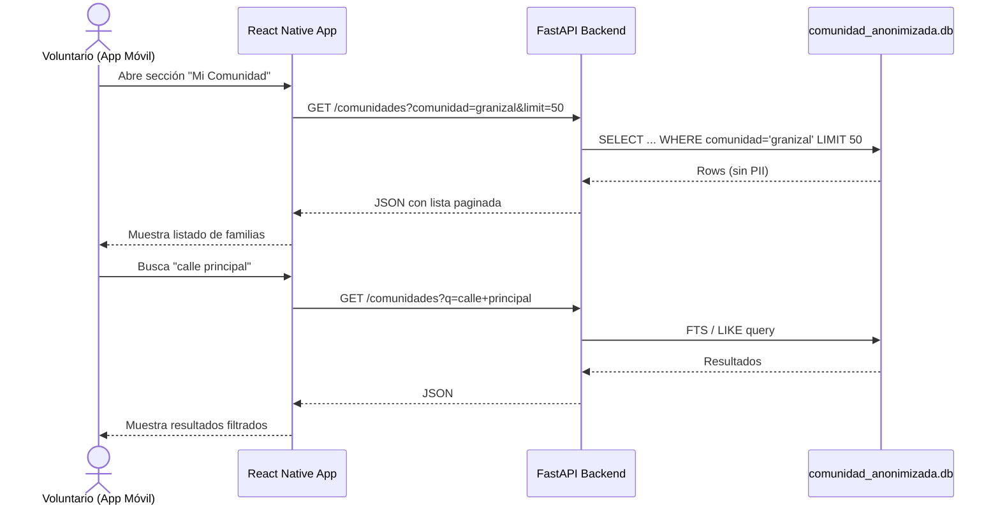
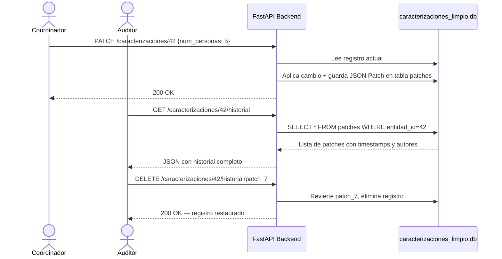
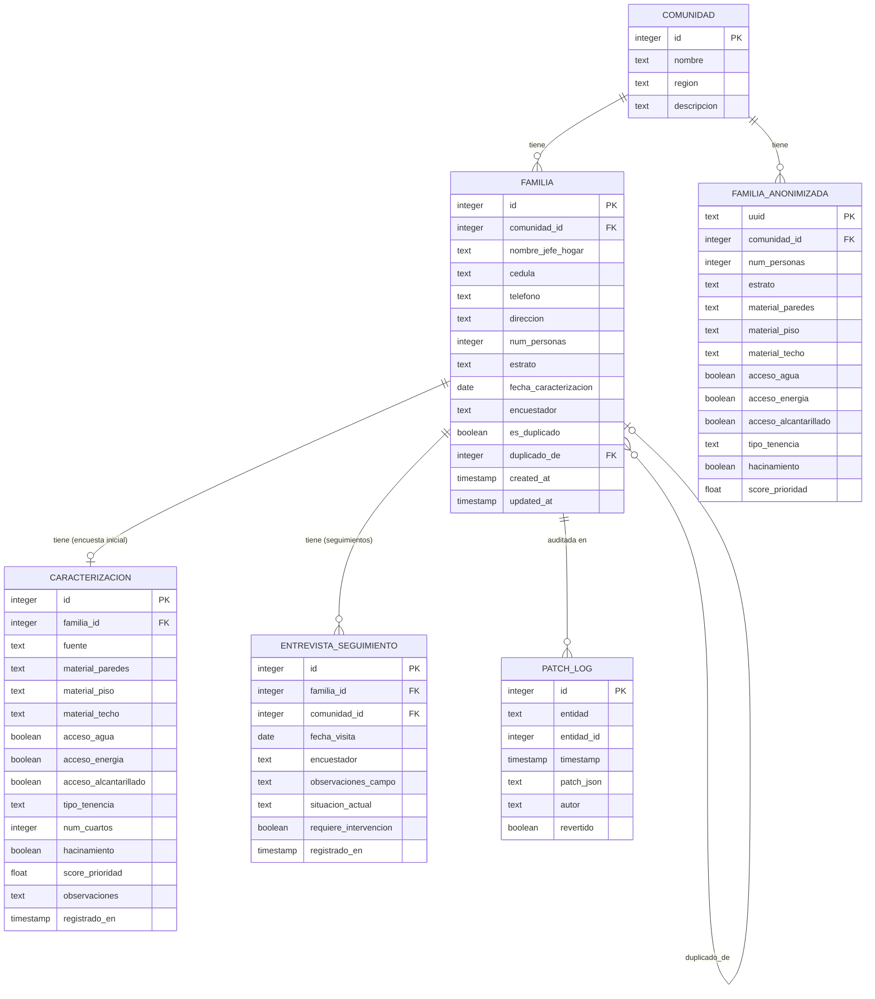
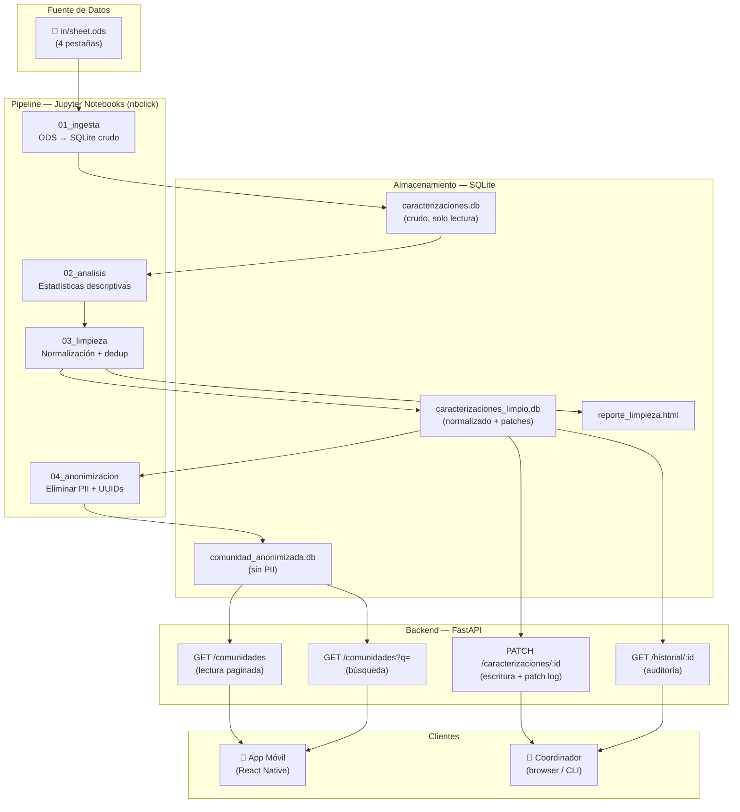
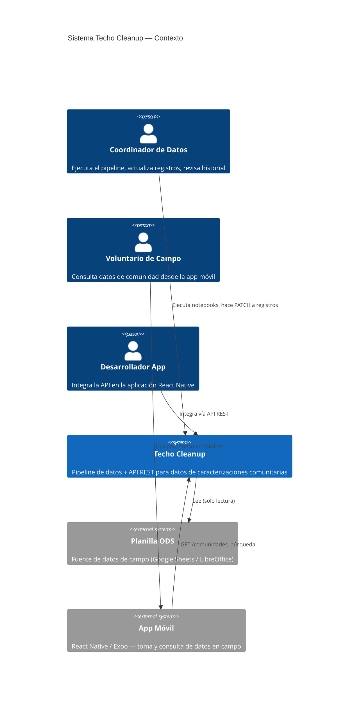
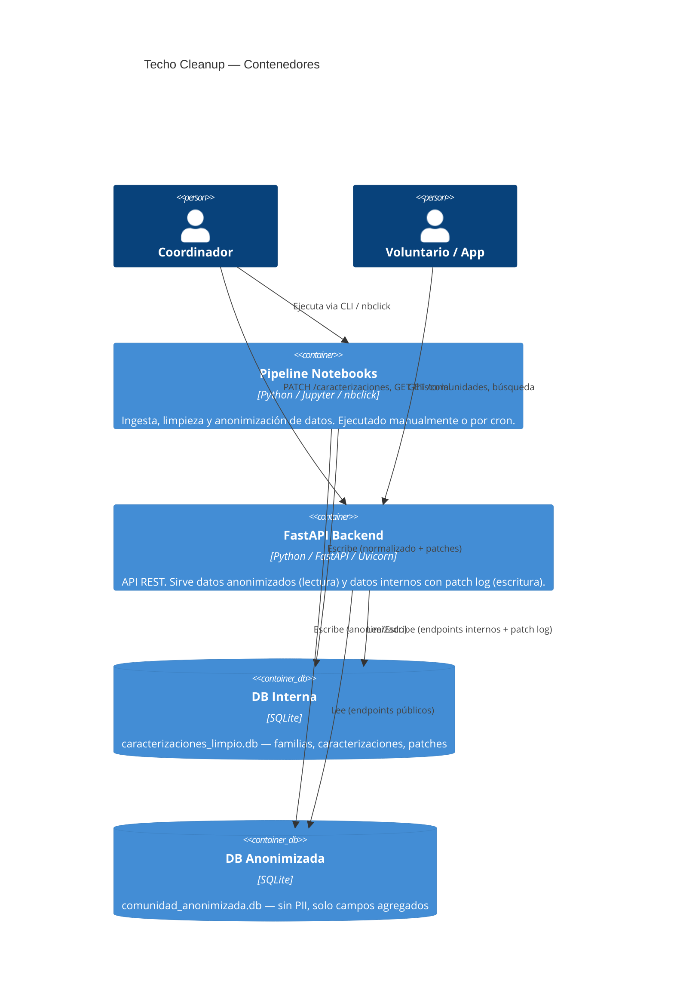
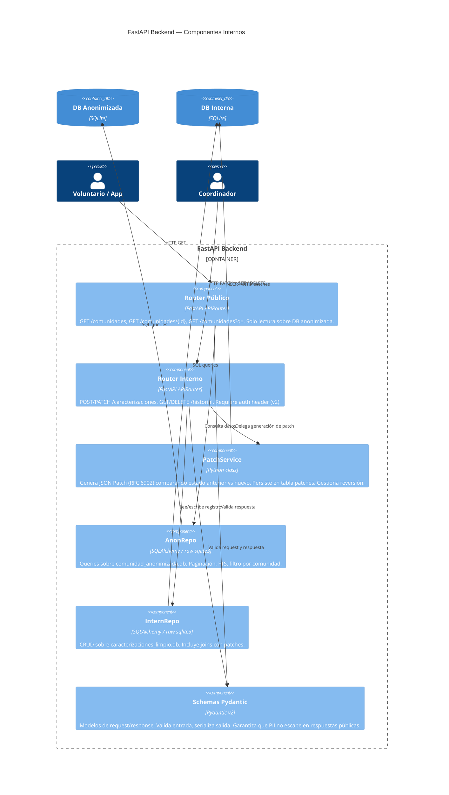
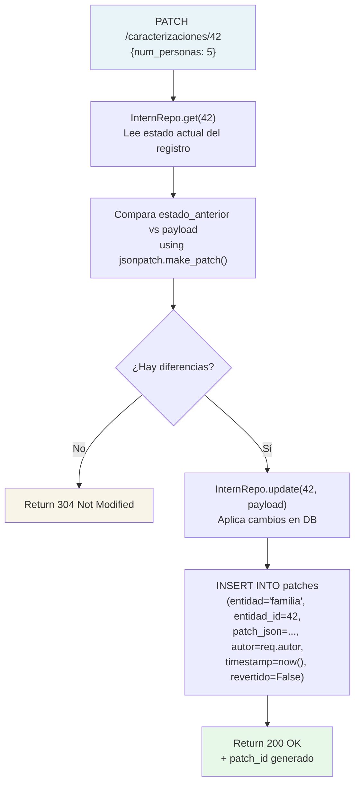

# OVERVIEW — Techo Cleanup: Pipeline de Datos Comunitarios

## Descripción Breve

**Techo Cleanup** es un pipeline de datos que transforma planillas ODS con entrevistas de campo (caracterizaciones de familias en asentamientos informales) en bases de datos relacionales limpias, normalizadas y auditables.

Los datos provienen de **dos Google Sheets** distintos:
1. **Google Sheet 1** — alimentado por un Google Form de encuesta inicial a familias → pestaña "Caracterizaciones"
2. **Google Sheet 2** — entrevistas de seguimiento por comunidad, ingreso manual → 3 pestañas de comunidad

Ambos se exportan en un único ODS que sirve de entrada al pipeline.

Produce dos artefactos principales: una base de datos interna completa para coordinadores, y una versión anonimizada sin datos personales (PII) expuesta mediante una API REST para consumo desde aplicaciones móviles de campo.

### Flujo de Origen

```
Google Form ──► Google Sheet 1 (Caracterizaciones) ──────────────────╮
                                                                       ► in/sheet.ods ──► Pipeline
Seguimiento manual ──► Google Sheet 2 (3 comunidades) ───────────────╯
```

## Funciones Principales

| Función | Descripción |
|---|---|
| **Ingesta** | Lee planillas `.ods` con datos de múltiples comunidades y las carga en SQLite sin pérdida de datos |
| **Limpieza** | Normaliza texto, fechas y codificación; detecta y marca duplicados con fuzzy matching por cédula y nombre |
| **Anonimización** | Elimina o hashea campos PII (nombres, cédulas, teléfonos, direcciones exactas) y reemplaza IDs por UUIDs no correlacionables |
| **API REST** | Sirve los datos anonimizados con paginación y búsqueda; acepta actualizaciones sobre datos internos almacenando cada cambio como JSON Patch (RFC 6902) |
| **Trazabilidad** | Toda modificación a un registro genera un patch almacenado con timestamp y autor, reversible de forma individual |

---

## Casos de Uso Principales

### UC-1 — Coordinador regenera la base de datos desde el ODS

El equipo de datos recibe una nueva versión de `sheet.ods` con datos frescos de campo. El coordinador ejecuta el pipeline completo para actualizar las bases SQLite, revisar el reporte de limpieza y publicar la nueva versión anonimizada.



---

### UC-2 — App móvil consulta datos de comunidad

Un voluntario en campo abre la app móvil. La app consulta la API REST para obtener el listado de familias de su comunidad asignada y busca un registro por texto.



---

### UC-3 — Auditor revisa historial de cambios de un registro

Un coordinador actualiza datos de una familia vía API (v2). Más tarde, el auditor revisa qué cambió, cuándo y quién lo modificó; decide revertir un patch específico.



---

## Modelo de Datos

### Diagrama Entidad-Relación



### Descripción de Entidades

| Entidad | Descripción | Fuente ODS | Base de datos |
|---|---|---|---|
| `COMUNIDAD` | Las 3 comunidades del proyecto (Granizal, La Honda, Nueva Jerusalen) | — | `caracterizaciones_limpio.db` |
| `FAMILIA` | Registro de cada hogar con datos completos incluyendo PII | Ambas pestañas | `caracterizaciones_limpio.db` |
| `CARACTERIZACION` | Encuesta inicial vía Google Form: condiciones de vivienda, servicios, hacinamiento | Pestaña "Caracterizaciones" (Sheet 1) | `caracterizaciones_limpio.db` |
| `ENTREVISTA_SEGUIMIENTO` | Visitas de seguimiento por comunidad, post-encuesta inicial | Pestañas por comunidad (Sheet 2) | `caracterizaciones_limpio.db` |
| `PATCH_LOG` | Historial de cambios vía API — cada PATCH genera un JSON Patch (RFC 6902) | — | `caracterizaciones_limpio.db` |
| `FAMILIA_ANONIMIZADA` | Versión sin PII de `FAMILIA` + `CARACTERIZACION` para app móvil, con UUID | — | `comunidad_anonimizada.db` |

### Campos PII (requieren anonimización)

`nombre_jefe_hogar`, `cedula`, `telefono`, `direccion` — eliminados o hasheados en `FAMILIA_ANONIMIZADA`.

---

## Diseño del Sistema a Alto Nivel

El sistema se organiza en tres capas: **ingesta/transformación** (notebooks), **almacenamiento** (SQLite), y **exposición** (FastAPI).



### Principios de Diseño

- **Inmutabilidad por capas**: cada fase lee de la anterior pero nunca la modifica. `caracterizaciones.db` es la fuente de verdad cruda, siempre preservada.
- **Idempotencia**: re-ejecutar cualquier notebook produce el mismo resultado dado el mismo input.
- **Separación PII / no-PII**: los datos personales nunca salen de `caracterizaciones_limpio.db`. La API pública solo toca `comunidad_anonimizada.db`.
- **Trazabilidad**: toda escritura vía API genera un JSON Patch almacenado e individualmente reversible.

---

## Diagrama C4 — Zoom en el Backend API

### Nivel 1 — Contexto del Sistema



### Nivel 2 — Contenedores



### Nivel 3 — Componentes del Backend API



### Nivel 4 — Detalle: PatchService


